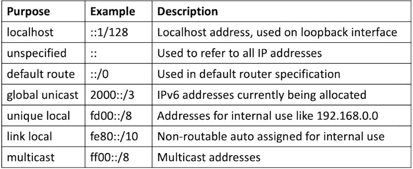

# Exploring IPv6

The majority of the Core Internet Infrastructure is running on IPv6, the reason is that the human population has already surpassed the amount of existing IPv4 Addresses. So, end users usually would use IPv4 behind a **device,** and when traffic goes outbound to the world (internet) then will be translated as IPv6.&#x20;

This device is known as a **NAT**&#x20;

* IPv6 addresses are 128-bit numbers, which are normally expressed as 8 colon-separated groups of four hexadecimal numbers.&#x20;
* Network Providers hand out a /48-prefixed address, which leaves 16 bits to t he customer to address (subnetting)

***

In IPv6, different address types are available:

<figure><figcaption></figcaption></figure>

***

* Apart from manual allocation and DHCP, IPv6. supports Stateless Address Autoconfiguration (SLAAC)
* In SLAAC, a host sends a router solicitation to the ff02::2 multicast group to access all routers
* A router answers that request, sending all relevant information&#x20;
* The host adds an automatically generated host ID to the network prefix to obtain a unique address in this way
* To enable RHEL for SLAAC support, install the **radvd** package (needs to serve as a router only)
