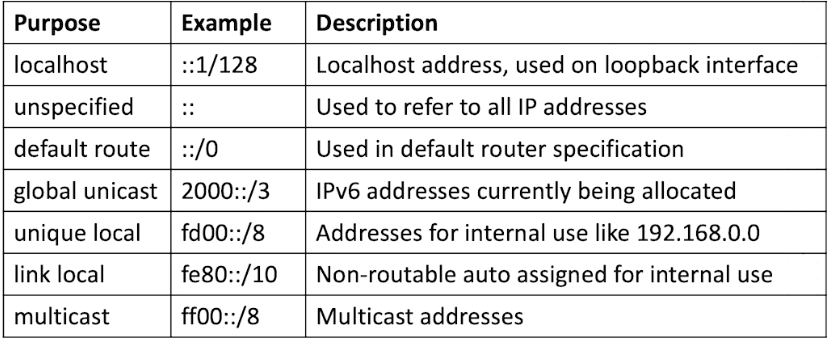

# Using an Editor

Linux configurations happens by modifying text files&#x20;

* Plain ASCII text is used for many files&#x20;
* YAML is common in configuration management, like Ansible, Kubernetes, etc.&#x20;
* JSON is often used as a data storage format&#x20;
* XML can be used as an alternative to JSON and YAML

Editors can modify text files shown above:

* nano
* vi/vim<br>

### Below is a VIM cheat sheet that might be helpful...



<figure><figcaption></figcaption></figure>



<figure><figcaption></figcaption></figure>



Others may include (which are not in the list)

```
:se number (shows the number of lines) 
:%s/bar/foo/g - replaces the word bar with the word foo in all the files
```

