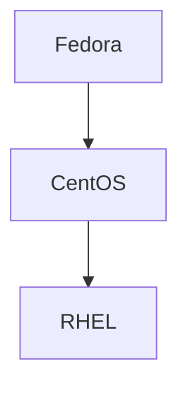

# What is CentOS vs CentOS Stream

## Brief History&#x20;

Greg Kurtzer grabbed the source code from RHEL and built CentOS, and then in 2014, it was acquired by Red Hat again.&#x20;

### Stream&#x20;

